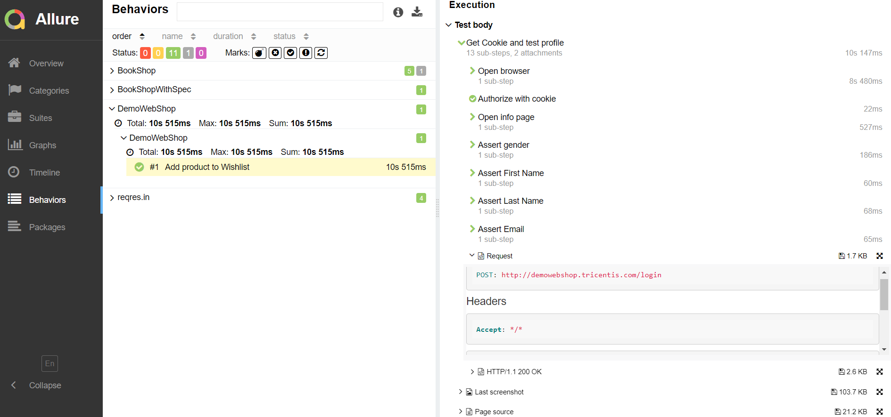

# REST API testing automation project

The project presents examples and approaches to API testing.
[Allure Report](#allure-report) includes autotests for GET and POST requests presented without logs, with various options for logs, specifications and models.
___

## The project is built with following technologies:

<p  align="center">


</p>

___

## API tests for [reqres.in](https://reqres.in/):

Contains the tests for GET and POST requests. These are the tests which check these 'handlers' functionality. They are created with special specification.
You may look them in Allure as Suit 'ApiRequestsTest':

<p align="center">
  
</p>

___

## API tests for [demowebshop](http://demowebshop.tricentis.com):

The tests demonstrate the use of preparation REST steps to checking web content. They use special specifications, user's templates and response model. Also there're the examples of using cookies for API testing.
In Allure they're in Suit 'DemowebshopTest':

<p align="center">
  
</p>

___

## API tests for BookShop on [https://demoqa.com](https://demoqa.com):

The tests are for examples API testing without logs, with some or all logs, use data requests and response models, user's templates or listener:
They're in Suit 'BooksShopTest'

<p align="center">
  
</p>

___

## Run tests from terminal locally

### Run tests with filled remote properties:

```bash
gradle clean test
```

### Run tests remote with parameters:

where:
> + ALLURE_NOTIFICATIONS_VERSION - select Allure notification version. By default - 2.2.3
> + PROJECT_NAME - description text that will be represented in telegram notification

<p align="center">
  
</p>

### Serve report:

```bash
allure serve build/allure-results
```

___

## Results analysis

The test results can be found in:
+ [Jenkins](#jenkins)
+ [Allure Report](#allure-report)
+ [Allure TestOps](#allure-testOps)
+ [Jira](#jira)

### [Jenkins](https://jenkins.autotests.cloud/job/09-roman-che-rest-api-tests/)

Once the launch finished you may watch statistics and open the `Allure Report` 

<p align="center">
  
</p>

### Allure Report

The example of a test build report grouped by suits is presented below.

<p align="center">
  
</p>

### Allure TestOps

Allure TestOps is used as a storage for all tests cases (automated and manual), launches, their results. You may watch statistic and reports by all launches and results

Dashboards:

<p align="center">
  
</p>

List of launches:

<p align="center">
  
</p>

List of tests grouped by features and launch history:

<p align="center">
  
</p>

### Jira

Also Jira integration is implemented in the project:

<p align="center">
  
</p>

___

## Example of video with test running in Allure Report

A video example showing simultaneous REST and UI test is presented below. This video was attached automatically to the Allure report.

https://github.com/roman-che/rest-api-tests/blob/main/img/screenshots/demoWebShopTestVideo.mp4

___

## Notifications in Telegram channel

The project is configured to send notifications with the launch results from Jenkins to Telegram channel. 
The project can be configured to send notifications by Email, Slack, Skype and Mattermost as well.

<p align="center">
  
</p>

___
